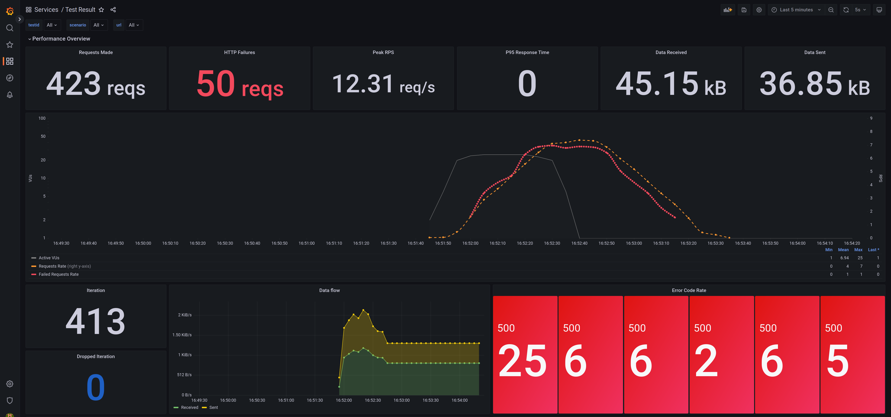

# Testing k6 with Prometheus and Grafana

Testing k6 test execution by using Prometheus remote write functionality and Grafana to visualize the results through a dashboard.

### Steps
- Build and run by executing:
```
./build_and_run.sh
```
- Through the browser, navigate to `http://localhost:3000`
- Type in `user: admin` and `password: admin`
- Set a new password
- Once logged into Grafana, through the left side menu, go to `Dashboards -> Browse` and select the `Test Result` one under `Services` section.


